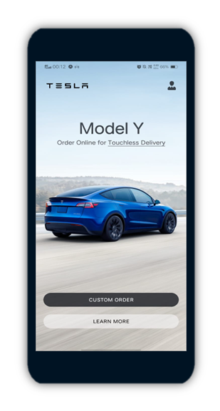
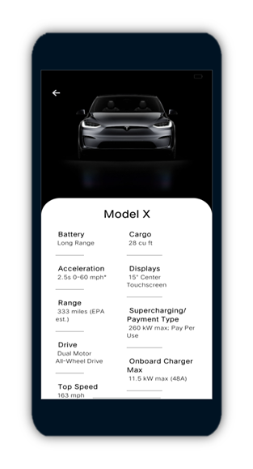
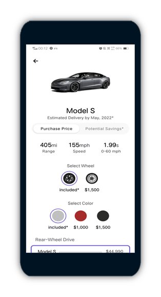
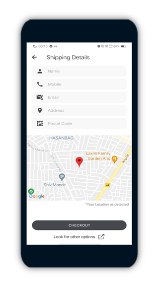
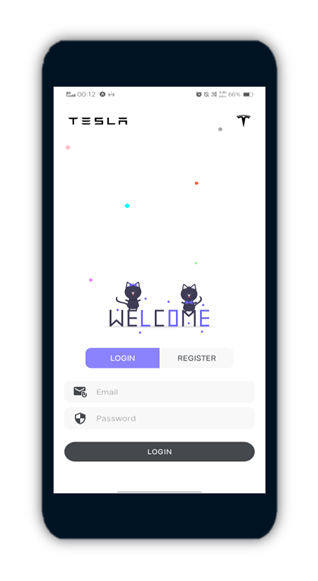
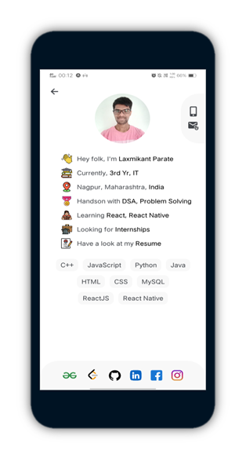

<h1>Tesla-App</h1>
    
An app to buy and get info about all tesla cars.

    <h3>ScreenShots:</h3>
    

      
      
      
      
      
      
    

    <h3>Tech used:</h3>
    
React Native, Firebase, JavaScript

    <h3>Download apk</h3>
    

      Download <a href="build/androidBuild.apk" download>this</a> file and
      install it on your android device.
    

    <h3>How to set up this project at your local system:</h3>
    

      <b>Step 1:</b> To run this project you need Node and expo installed. If
      you don't have it, follow
      <a href="https://docs.expo.dev/get-started/installation/" target="_blank"
        >this</a
      >
      to get started.
    

    

      <b>Step 1:</b> Copy link to this repository, then you can clone this
      repository by simply running the command
      <b>"git clone [link_to_repo]"</b>.
    

    

      <b>Step 2:</b> Now you need to install all the dependencies. All the
      dependencies used are listed in "pakage.json" file. To install all the
      dependencies at once run the command <b>"npm install"</b>.
    

    

      <b>Step 4:</b> You will also need an emulator. For an android emulator
      follow
      <a
        href="https://docs.expo.dev/workflow/android-studio-emulator/"
        target="_blank"
        >this</a
      >
      and for an ios simulator follow
      <a
        href="https://developer.apple.com/documentation/xcode/running-your-app-in-the-simulator-or-on-a-device"
        target="_blank"
        >this</a
      >
    

    

      <b>Step 5:</b> Now that all setup is done, you can start the development
      server by running command <b>"expo start"</b>. After the server is
      started, type "a" to run your project on android emulator.
    

    <h3>If you like my work, you can support me by giving this repo a ⭐</h3>
